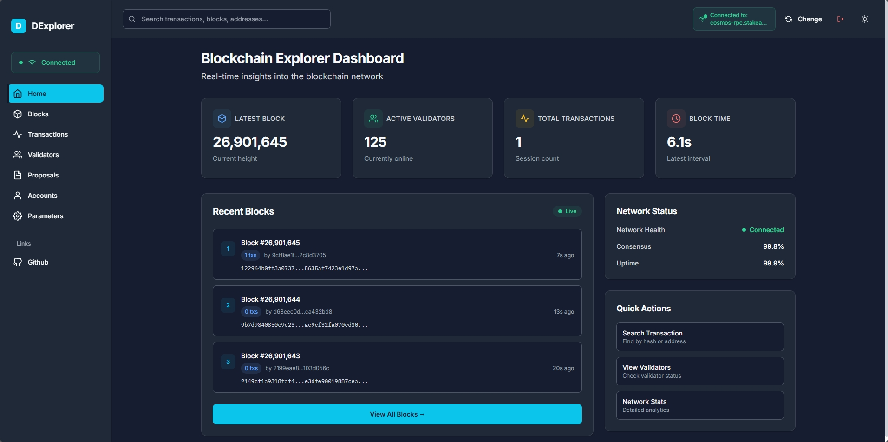
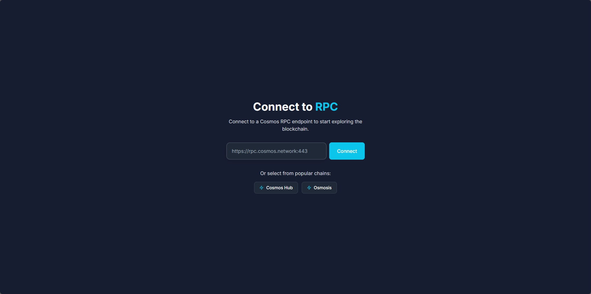

<div align="center">
  <h1 align="center">🚀 Dexplorer</h1>

  <p align="center">
    <strong>Disposable Cosmos-based Blockchain Explorer</strong>
    <br />
    A lightweight, real-time blockchain explorer for Cosmos SDK chains
    <br />
    <br />
    <a href="#demo">View Demo</a>
    ·
    <a href="https://github.com/arifintahu/dexplorer/issues">Report Bug</a>
    ·
    <a href="https://github.com/arifintahu/dexplorer/issues">Request Feature</a>
  </p>

  <p align="center">
    <a href="https://github.com/arifintahu/dexplorer/blob/main/LICENSE">
      
    </a>
    <a href="https://github.com/arifintahu/dexplorer/deployments/activity_log">
      
    </a>
    <a href="https://github.com/arifintahu/dexplorer/graphs/contributors">
      
    </a>
    <a href="https://github.com/arifintahu/dexplorer/stargazers">
      
    </a>
    <a href="https://github.com/arifintahu/dexplorer/network/members">
      
    </a>
  </p>
</div>

## 📋 Table of Contents

- [About](#about)
- [Demo](#demo)
- [Features](#features)
- [Tech Stack](#tech-stack)
- [Prerequisites](#prerequisites)
- [Installation](#installation)
- [Usage](#usage)
- [Project Structure](#project-structure)
- [Contributing](#contributing)
- [FAQ](#faq)
- [License](#license)
- [Contributors](#contributors)

## 🌟 About

**Dexplorer** is a disposable, lightweight blockchain explorer specifically designed for Cosmos-based blockchains. Unlike traditional explorers that require backend infrastructure and databases, Dexplorer operates entirely as a frontend application, connecting directly to any Cosmos SDK chain using only WebSocket RPC connections.

This makes it perfect for:
- 🔧 **Development**: Quick exploration during chain development
- 🧪 **Testing**: Instant setup for testnets and local chains
- 📊 **Monitoring**: Real-time blockchain data visualization
- 🚀 **Deployment**: Zero backend infrastructure required

## 🎬 Demo

### Screenshots

#### 🏠 Home Dashboard

*Real-time blockchain explorer dashboard showing chain statistics, latest blocks, and transactions*

#### 🔗 Connect to Blockchain

*Simple connection interface to connect to any Cosmos SDK RPC endpoint*

### Live Demo

🌐 **[Try Dexplorer Live](https://dexplorer.arifintahu.com)**

*Connect to any Cosmos RPC endpoint and start exploring!*

## ✨ Features

- 🔗 **Universal Connectivity**: Connect to any Cosmos-based RPC endpoint
- 📊 **Real-time Dashboard**: Monitor chain activity with live updates
- 🔔 **Live Subscriptions**: Subscribe to latest blocks and transactions
- 🔍 **Powerful Search**: Find blocks, transactions, and accounts instantly
- 👥 **Validator Insights**: Browse active validators and their details
- 🗳️ **Governance**: Explore proposals and voting results
- ⚙️ **Chain Parameters**: View blockchain configuration and parameters
- 📱 **Responsive Design**: Works seamlessly on desktop and mobile
- 🎨 **Modern UI**: Clean, intuitive interface with dark/light themes
- ⚡ **Zero Backend**: No database or server infrastructure needed

## 🛠️ Tech Stack

### Frontend
- **React 18** - Modern React with hooks and concurrent features
- **TypeScript** - Type-safe development
- **Vite** - Lightning-fast build tool and dev server
- **Tailwind CSS** - Utility-first CSS framework
- **Zustand** - Lightweight state management
- **React Router** - Client-side routing

### Blockchain Integration
- **CosmJS** - Cosmos SDK JavaScript library
- **WebSocket RPC** - Real-time blockchain data
- **Protobuf** - Message encoding/decoding

### Development Tools
- **ESLint** - Code linting
- **Prettier** - Code formatting
- **Vercel** - Deployment platform

## 📋 Prerequisites

Before running Dexplorer, ensure you have:

- **Node.js** (v18.0.0 or higher)
- **pnpm** (v8.0.0 or higher) - *Recommended package manager*
- **Git** - For cloning the repository

## 🚀 Installation

### Quick Start

```bash
# Clone the repository
git clone https://github.com/arifintahu/dexplorer.git

# Navigate to project directory
cd dexplorer

# Install dependencies
pnpm install

# Start development server
pnpm dev
```

### Alternative Installation Methods

#### Using npm
```bash
npm install
npm run dev
```

#### Using yarn
```bash
yarn install
yarn dev
```

### Production Build

```bash
# Build for production
pnpm build

# Preview production build
pnpm preview
```

## 📖 Usage

### Basic Usage

1. **Start the Application**
   ```bash
   pnpm dev
   ```
   Open [http://localhost:5173](http://localhost:5173) in your browser

2. **Connect to a Blockchain**
   - Enter a Cosmos RPC endpoint (e.g., `https://rpc.cosmos.network:443`)
   - Click "Connect" to establish connection

3. **Explore the Blockchain**
   - View the dashboard for chain overview
   - Search for specific blocks, transactions, or accounts
   - Browse validators and governance proposals

## 📁 Project Structure

```
dexplorer/
├── public/                 # Static assets
├── src/
│   ├── components/         # Reusable UI components
│   │   ├── CodeBlock/      # Code syntax highlighting
│   │   ├── Layout/         # App layout components
│   │   └── ui/             # Basic UI components
│   ├── encoding/           # Message encoding utilities
│   │   ├── msg.ts          # Message type definitions
│   │   └── proposal.ts     # Proposal encoding
│   ├── hooks/              # Custom React hooks
│   ├── pages/              # Page components
│   │   ├── AccountDetail.tsx
│   │   ├── BlockDetail.tsx
│   │   ├── Dashboard.tsx
│   │   ├── ProposalDetail.tsx
│   │   └── TransactionDetail.tsx
│   ├── store/              # State management
│   ├── types/              # TypeScript type definitions
│   ├── utils/              # Utility functions
│   └── main.tsx            # Application entry point
├── package.json            # Dependencies and scripts
├── tailwind.config.js      # Tailwind CSS configuration
├── tsconfig.json           # TypeScript configuration
└── vite.config.ts          # Vite configuration
```

## 🤝 Contributing

We welcome contributions from the community! Here's how you can help:

### Development Workflow

1. **Fork the Repository**
   ```bash
   # Fork on GitHub, then clone your fork
   git clone https://github.com/YOUR_USERNAME/dexplorer.git
   ```

2. **Create a Feature Branch**
   ```bash
   git checkout -b feature/amazing-feature
   ```

3. **Make Your Changes**
   - Follow the existing code style
   - Add tests for new features
   - Update documentation as needed

4. **Test Your Changes**
   ```bash
   pnpm test
   pnpm build
   ```

5. **Commit and Push**
   ```bash
   git commit -m 'Add amazing feature'
   git push origin feature/amazing-feature
   ```

6. **Create a Pull Request**
   - Describe your changes clearly
   - Link any related issues
   - Wait for review and feedback

### Code Style Guidelines

- Use **TypeScript** for all new code
- Follow **ESLint** and **Prettier** configurations
- Write **descriptive commit messages**
- Add **JSDoc comments** for complex functions
- Ensure **responsive design** for UI changes

### Reporting Issues

Found a bug? Have a feature request?

1. Check existing [issues](https://github.com/arifintahu/dexplorer/issues)
2. Create a new issue with detailed description
3. Include steps to reproduce (for bugs)
4. Add relevant labels

### Community Requests
- 💡 **Your Ideas**: [Suggest features](https://github.com/arifintahu/dexplorer/issues/new?template=feature_request.md)

## ❓ FAQ

### General Questions

**Q: What makes Dexplorer different from other blockchain explorers?**
A: Dexplorer is frontend-only, requiring no backend infrastructure. It connects directly to RPC endpoints, making it perfect for development and testing environments.

**Q: Can I use Dexplorer with my local blockchain?**
A: Yes! Simply point it to your local RPC endpoint (usually `http://localhost:26657`).

**Q: Is Dexplorer compatible with all Cosmos SDK chains?**
A: Dexplorer works with any Cosmos SDK chain that exposes standard RPC endpoints.

## 📄 License

This project is licensed under the **MIT License** - see the [LICENSE](LICENSE) file for details.

```
MIT License

Copyright (c) 2024 Arifin Tahu

Permission is hereby granted, free of charge, to any person obtaining a copy
of this software and associated documentation files (the "Software"), to deal
in the Software without restriction, including without limitation the rights
to use, copy, modify, merge, publish, distribute, sublicense, and/or sell
copies of the Software, and to permit persons to whom the Software is
furnished to do so, subject to the following conditions:

The above copyright notice and this permission notice shall be included in all
copies or substantial portions of the Software.
```

## 👥 Contributors

Thanks to all the amazing people who have contributed to this project:

<div align="center">
  <a href="https://github.com/arifintahu/dexplorer/graphs/contributors">
    
  </a>
</div>

### Core Team
- **[@arifintahu](https://github.com/arifintahu)** - Creator & Maintainer

### How to Become a Contributor
1. Fork the repository
2. Make meaningful contributions
3. Submit pull requests
4. Help with issues and discussions
5. Spread the word about Dexplorer!

---

<div align="center">
  <p>
    <strong>Made with ❤️ for the Cosmos ecosystem</strong>
  </p>
  <p>
    <a href="#top">⬆️ Back to Top</a>
  </p>
</div>